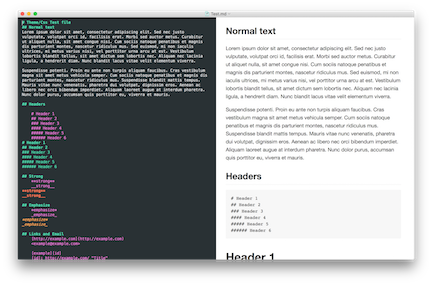

## Mou Themes Collection

As you may know [Mou](http://mouapp.com/) is an awesome markdown editor with live preview. This editor can be customized using **themes** (Editor mode) and **css** (Live preview, HTML/PDF export)

This repository will collect many extra themes and css for Mou app.

### Why?
The other day i found myself looking for giving Mou a new look on some of my pdfs. During my searches I see that exists a lot of themes for Mou but they are scattered around git and other websites so I created this small repository.

### How to install
Download the right file from [here]() or clone this repository.

#### Themes
Copy all `.txt` files from `Themes` directory to `~/Library/Application Support/Mou/Themes`.

#### CSS
Copy all `.css` files in `CSS` directory to `~/Library/Application Support/Mou/CSS`

### List of Themes and Css
#### CodeCatalyst
  
**Solarized (Dark) - Theme + Css**

  
**Solarized (Light) - Theme + Css**

#### hzlhz
  
**Sublime + GitHub Readme - Theme + Css**

#### kvanlierop
  
**Byword (dark) - Theme + Css**

### To theme's author(s)
**I do not want to steal the visibility or the popularity of other theme makers but I want a simple method to download more themes for Mou.**

If your theme is not in this list and you want to have it here just open an issues or mail me.

When I'll add a theme to this collection I'll put a reference to the original author(s) but, if they wish, I will remove every questioned files. Fill an issue or send me a mail.

When possible I'll use git submodule and I'll track your repository to keep everything updated.

### Credits
* Mou app - [http://mouapp.com/](http://mouapp.com/)
* CodeCatalyst - [https://github.com/CodeCatalyst/mou-theme-solarized](https://github.com/CodeCatalyst/mou-theme-solarized)
* gcollazo - [https://github.com/gcollazo/mou-theme-github2](https://github.com/gcollazo/mou-theme-github2)
* hzlhz - [https://github.com/hzlzh/Mou-Theme](https://github.com/hzlzh/Mou-Theme)
* kvanlierop - [https://github.com/kvanlierop/byword-for-mou](https://github.com/kvanlierop/byword-for-mou)